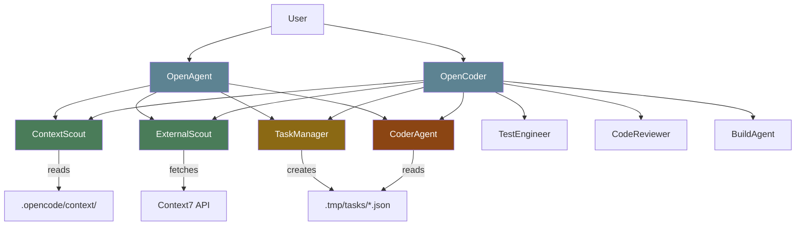
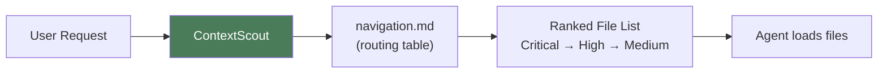
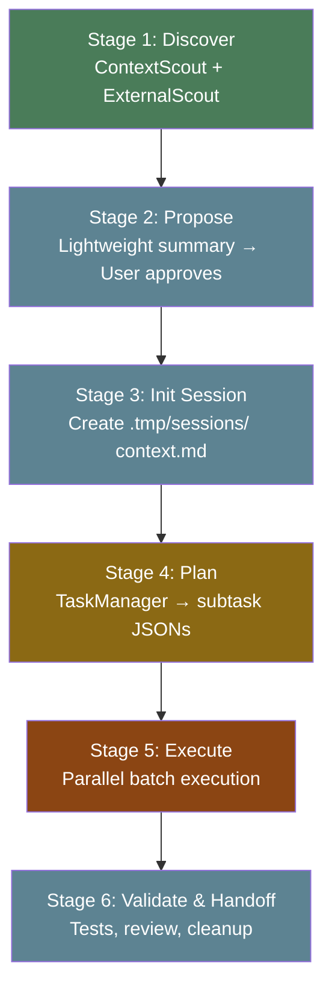
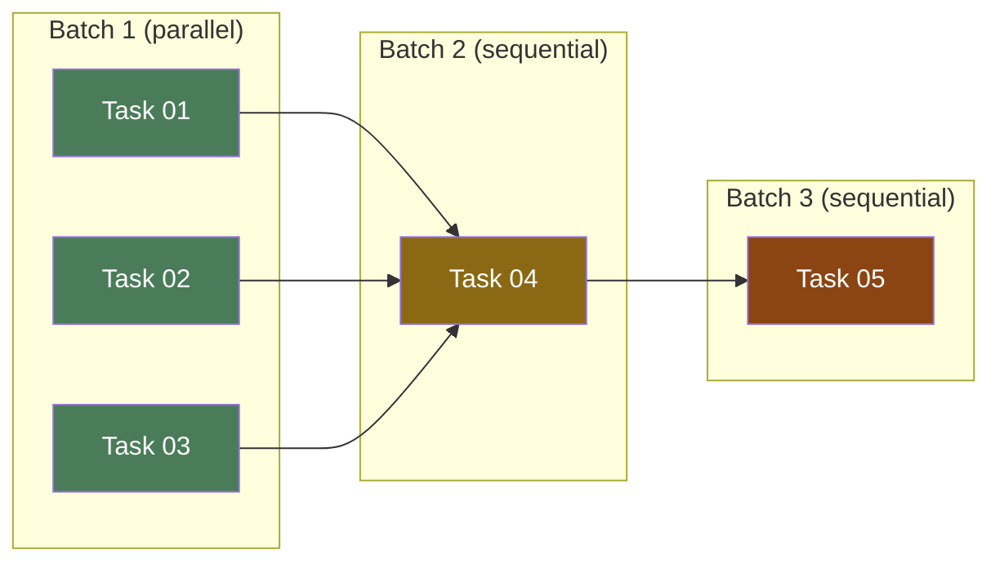
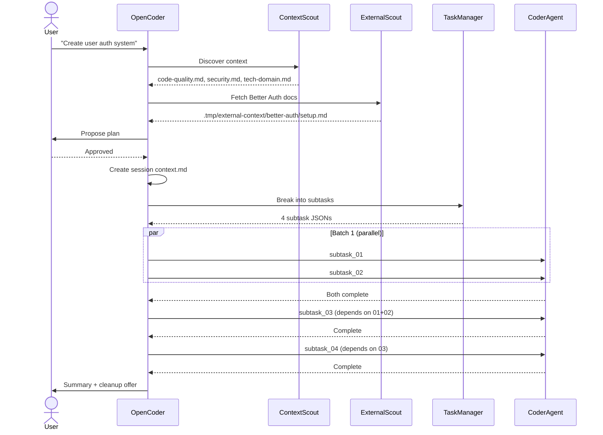
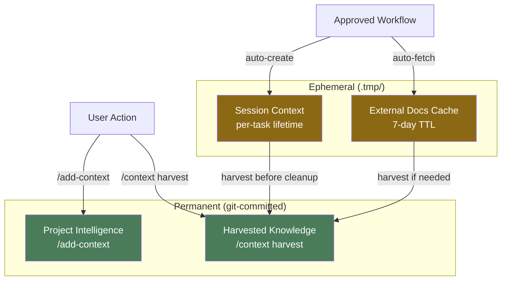

# OpenAgents Control

### AI Agent Orchestration That Learns Your Patterns

<div class="pt-8">
  <span class="px-2 py-1 rounded text-sm" style="background: #5d839233">
    v0.7.1 · MIT License · Built on OpenCode
  </span>
</div>

<div class="abs-br m-6 flex gap-2">
  <a href="https://github.com/darrenhinde/OpenAgentsControl" target="_blank" class="text-xl slidev-icon-btn opacity-50 !border-none !hover:text-white">
    <carbon-logo-github />
  </a>
</div>

<!--
Welcome to the OpenAgents Control deep-dive.
This deck covers architecture, context system, workflows, task management, and customization.
Audience: experienced developers evaluating or onboarding to OAC.
-->

---
layout: center
class: text-center
---

# The Problem

<v-clicks>

Most AI coding tools produce **generic code** that doesn't match your project's patterns

You spend more time **refactoring AI output** than you saved

Every team member gets **different results** for the same request

There's **no approval gate** — the AI just does things

</v-clicks>

<!--
This is the core motivation. AI tools are fast but inconsistent.
OAC trades some speed for repeatability and pattern-matching.
-->

---
layout: center
class: text-center
---

# The OAC Solution

<v-clicks>

**Context-Before-Code** — Load your patterns *before* generating anything

**Human-in-the-Loop** — AI proposes, you approve

**Markdown-as-Code** — Everything is editable text files

**Token Efficient** — ~80% reduction via Minimal Viable Information

</v-clicks>

---
layout: section
---

# Architecture

---
layout: two-cols-header
---

## Five Subsystems

Everything lives under `.opencode/` — plain Markdown + JSON, no compilation.

::left::

<v-clicks>

**`agent/`** — Agent definitions
- `core/` — OpenAgent, OpenCoder
- `subagents/` — 11 specialists

**`context/`** — Knowledge base
- `core/standards/` — Universal rules
- `project-intelligence/` — YOUR patterns

**`command/`** — Slash commands

</v-clicks>

::right::

<v-clicks>

**`skills/`** — Reusable capabilities
- Task management CLI
- Context7 API integration

**`tool/`** — Custom tools

```
.opencode/
├── agent/
├── context/
├── command/
├── skills/
└── tool/
```

</v-clicks>

---

## Agent Hierarchy



<!--
Two primary agents (user-facing), 11 subagents (auto-delegated).
ContextScout is read-only. ExternalScout fetches live docs.
TaskManager decomposes work. CoderAgent executes.
-->

---

## Primary Agents

| Agent | Purpose | Best For |
|-------|---------|----------|
| **OpenAgent** | Universal — questions, tasks, coordination | Simple features, analysis, learning |
| **OpenCoder** | Production — sessions, parallel execution | Complex features, multi-file refactoring |

<v-click>

### Key Difference

```
OpenAgent:  Analyze → Discover → Approve → Execute → Validate → Summarize
OpenCoder:  Discover → Propose → Init Session → Plan → Execute (Parallel) → Validate
```

</v-click>

<v-click>

OpenCoder adds **session management** (`.tmp/sessions/`) and **parallel batch execution** via TaskManager.

</v-click>

---

## Agent Definition Format

Agents are **Markdown files with YAML frontmatter** — edit text to change behavior:

```yaml {all|2-4|5-14|all}
---
name: CoderAgent
description: "Executes coding subtasks with self-review"
temperature: 0
permission:
  bash:
    "*": "deny"
    "bash .opencode/skills/task-management/router.sh complete*": "allow"
    "bash .opencode/skills/task-management/router.sh status*": "allow"
  edit:
    "**/*.env*": "deny"
    "node_modules/**": "deny"
  task:
    contextscout: "allow"
    externalscout: "allow"
---

# Agent instructions in Markdown + XML...
```

<v-click>

Three permission levels: `"allow"` (silent) · `"ask"` (prompt user) · `"deny"` (blocked)

</v-click>

<!--
This is the key design insight: agents are editable text files.
No compilation, no vendor lock-in. Change behavior by editing markdown.
-->

---
layout: section
---

# The Context System

### OAC's Core Innovation

---
layout: two-cols
---

## Context Categories

<v-clicks>

- **`core/standards/`** — Code quality, tests, docs, security
- **`core/workflows/`** — Code review, delegation, sessions
- **`project-intelligence/`** — YOUR tech stack & patterns
- **`development/`** — Language/framework patterns
- **`ui/`** — Design system, components

</v-clicks>

::right::

## Mandatory Loading

| Task Type | Must Load |
|-----------|-----------|
| Write code | `code-quality.md` |
| Write tests | `test-coverage.md` |
| Write docs | `documentation.md` |
| Code review | `code-review.md` |
| Delegate | `task-delegation.md` |

<v-click>

> This is **enforced**, not optional. Agents cannot skip context loading.

</v-click>

---

## MVI — Minimal Viable Information

Every context file follows MVI for token efficiency:

<v-clicks>

- **Core concept:** 1-3 sentences
- **Key points:** 3-5 bullets
- **Minimal example:** 5-10 lines of code
- **Reference link:** to full docs
- **File size:** <200 lines (scannable in <30s)

</v-clicks>

<v-click>

```
Traditional:  Load entire codebase context → 8,000+ tokens per request
OAC:          Load only relevant patterns  →   750  tokens per request
                                              ─────────────────────────
                                              ~80% token reduction
```

</v-click>

<!--
MVI is the reason OAC is cost-effective at scale.
You're not paying for 8K tokens of irrelevant context every request.
-->

---

## ContextScout — Discovery Agent

**Read-only** subagent that discovers relevant context files:



<v-click>

**Constraints:** Can only `read`, `grep`, `glob` — cannot write, edit, bash, or delegate.

</v-click>

<v-click>

**ExternalScout** complements it by fetching **live docs** for external libraries via [Context7 API](https://context7.com) — preventing outdated training data from producing broken code.

</v-click>

---

## Project Intelligence

Teach agents YOUR patterns with `/add-context` (~5 min wizard):

<v-clicks>

1. **Tech stack** — Framework, language, database, styling
2. **API pattern** — Paste your actual endpoint code
3. **Component pattern** — Paste your actual component code
4. **Naming conventions** — Files, components, functions, database
5. **Code standards** — TypeScript strict, Zod validation, etc.
6. **Security requirements** — Input validation, parameterized queries

</v-clicks>

<v-click>

Creates `project-intelligence/technical-domain.md` — marked **Priority: critical**, loaded before every code generation task.

</v-click>

---
layout: section
---

# Workflow Engine

---

## Critical Rules

Enforced across **all** agents — higher tiers always win:

| Rule | Enforcement |
|------|-------------|
| **Approval Gate** | Request approval before ANY write/edit/bash |
| **Stop on Failure** | STOP on errors — NEVER auto-fix |
| **Report First** | REPORT → PROPOSE → APPROVE → FIX |
| **Context Loading** | NEVER execute without loading context |

<v-click>

```
Tier 1: Safety & Approval Gates     ← Always wins
Tier 2: Core Workflow (stages)
Tier 3: Optimization (speed)
```

</v-click>

<!--
This is what makes OAC safe for production.
No "oh no, what did the AI just do?" moments.
-->

---

## OpenCoder Workflow



<v-click>

The **session context.md** is the single source of truth for all downstream agents — request, standards, references, constraints, exit criteria.

</v-click>

---

## CoderAgent Self-Review

Before signaling completion, every CoderAgent runs a **mandatory 4-check loop**:

<v-clicks>

1. **Type & Import Validation** — Mismatched signatures, missing imports, circular deps
2. **Anti-Pattern Scan** — `console.log`, `TODO`, hardcoded secrets, `any` types
3. **Acceptance Criteria** — Every criterion from the subtask JSON is met
4. **ExternalScout Verification** — Usage matches documented API

</v-clicks>

<v-click>

```
Self-Review: ✅ Types clean | ✅ Imports verified | ✅ No debug artifacts
             ✅ All acceptance criteria met | ✅ External libs verified
```

If ANY check fails → fix before signaling completion.

</v-click>

---
layout: section
---

# Task Management

---

## Task Decomposition

For complex features (4+ files), TaskManager creates atomic JSON subtasks:

```
.tmp/tasks/user-auth/
├── task.json              ← Feature metadata
├── subtask_01.json        ← parallel: true, no deps
├── subtask_02.json        ← parallel: true, no deps
├── subtask_03.json        ← depends_on: [01, 02]
└── subtask_04.json        ← depends_on: [03]
```

<v-click>

**Key distinction:**
- `context_files` = standards to follow (conventions, patterns)
- `reference_files` = source code to study (existing project files)
- **Never mix them.**

</v-click>

---

## Subtask Schema

```json {all|4|5-6|7|10-13|all}
{
  "id": "user-auth-02",
  "seq": "02",
  "title": "Implement JWT service",
  "status": "pending",
  "depends_on": ["01"],
  "parallel": false,
  "suggested_agent": "CoderAgent",
  "context_files": [".opencode/context/core/standards/code-quality.md"],
  "acceptance_criteria": [
    "JWT tokens signed with RS256",
    "Access tokens expire in 15 minutes"
  ],
  "deliverables": ["src/auth/jwt.service.ts"]
}
```

<v-click>

Enhanced schema v2.0 adds **line-number precision** for large context files:

```json
"context_files": [
  { "path": "code-quality.md", "lines": "53-95", "reason": "Pure function patterns" }
]
```

</v-click>

---

## Parallel Execution

Tasks grouped into dependency-ordered batches:



<v-clicks>

- **Within a batch:** All tasks start simultaneously
- **Between batches:** Wait for 100% completion
- **Result:** 50-70% time savings for multi-component features

</v-clicks>

---

## Task CLI

```bash
# Check overall progress
bash .opencode/skills/task-management/router.sh status

# Find next eligible tasks (dependencies satisfied)
bash .opencode/skills/task-management/router.sh next

# Find parallelizable tasks
bash .opencode/skills/task-management/router.sh parallel

# Mark subtask complete
bash .opencode/skills/task-management/router.sh complete user-auth 01 \
  "Implemented JWT auth with refresh tokens"

# Validate JSON files and dependency graph
bash .opencode/skills/task-management/router.sh validate
```

---
layout: section
---

# Commands & Skills

---
layout: two-cols
---

## Slash Commands

<v-clicks>

| Command | Purpose |
|---------|---------|
| `/add-context` | Teach patterns |
| `/commit` | Smart git commit |
| `/test` | Test pipeline |
| `/optimize` | Code analysis |
| `/context harvest` | Clean summaries |
| `/context validate` | Check integrity |
| `/context migrate` | Global → local |

</v-clicks>

::right::

## Skills

<v-clicks>

**Task Management**
```bash
router.sh status|next|parallel
router.sh complete <f> <s> "msg"
router.sh validate
```

**Context7 API**
```bash
# Search for library
curl -s "https://context7.com/api/v2/\
libs/search?libraryName=react"

# Fetch docs
curl -s "https://context7.com/api/v2/\
context?libraryId=ID&query=hooks"
```

No API key required.

</v-clicks>

---
layout: section
---

# End-to-End Data Flow

---

## Complete Feature Request Flow



---
layout: section
---

# Customization

---
layout: two-cols
---

## What You Can Edit

<v-clicks>

**Agent behavior**
```bash
nano .opencode/agent/core/opencoder.md
```

**Agent model**
```yaml
model: anthropic/claude-sonnet-4-5
```

**Permissions**
```yaml
permission:
  bash:
    "docker *": "allow"
```

</v-clicks>

::right::

<v-clicks>

**Project patterns**
```bash
/add-context          # wizard
/add-context --update # update
```

**Custom commands**
```bash
# Create .opencode/command/my-cmd.md
/my-cmd
```

**Custom skills**
```bash
# Create .opencode/skills/my-skill/
# with SKILL.md
```

**Team sharing**
```bash
git add .opencode/context/
git commit && git push
# Everyone uses same patterns
```

</v-clicks>

---

## For Teams

<v-clicks>

**Share patterns via git** — commit `.opencode/context/project-intelligence/`

**New developers inherit standards on day 1** — no onboarding docs to read

**Local overrides global** — project patterns always win

**Different projects, different patterns:**

</v-clicks>

<v-click>

```
project-a/.opencode/context/project-intelligence/
  technical-domain.md  → React 19 + TypeScript + PostgreSQL

project-b/.opencode/context/project-intelligence/
  technical-domain.md  → FastAPI + Python + MongoDB
```

</v-click>

---
layout: section
---

# Knowledge Persistence

### How Project Knowledge Is Saved

---

## Four Knowledge Layers

| Layer | Where | Trigger | Auto? |
|-------|-------|---------|-------|
| **Project Intelligence** | `.opencode/context/project-intelligence/` | User runs `/add-context` | No |
| **External Docs Cache** | `.tmp/external-context/` | Agent fetches in approved workflow | Semi |
| **Session Context** | `.tmp/sessions/` | Agent creates after approval | Semi |
| **Harvested Knowledge** | `.opencode/context/` | User runs `/context harvest` | No |

<v-click>

> **Key insight:** OAC has **no background automation**. No file watchers, no git hooks, no cron jobs. Permanent knowledge always requires explicit user action.

</v-click>

---
layout: two-cols
---

## Permanent Knowledge

<v-clicks>

**Project Intelligence** (user-triggered)

| Event | Action |
|-------|--------|
| First setup | `/add-context` |
| Stack changes | `/add-context --update` |
| New decision | Edit `decisions-log.md` |
| New debt | Edit `living-notes.md` |

Git-committed. Versioned. Reviewed per PR.

**Harvested Knowledge** (user-triggered)

```bash
/context harvest
# Scans for *OVERVIEW.md, SESSION-*.md
# Shows approval UI (A B C or 'all')
# Extracts → permanent context
```

</v-clicks>

::right::

## Ephemeral Knowledge

<v-clicks>

**External Docs Cache** (semi-automatic)

```
Agent detects library
  → ExternalScout checks cache
  → Hit (<7 days)? Return paths
  → Miss? Fetch via Context7 API
         Write to .tmp/
         Return paths
```

Never git-committed. 7-day TTL.

**Session Context** (semi-automatic)

```
User approves plan
  → Agent creates context.md
  → All subagents read from it
  → Task completes
  → Agent asks: "Clean up?"
  → User confirms deletion
```

Agent-created, user-destroyed.

</v-clicks>

---

## Knowledge Lifecycle



<v-click>

**Why no automation?** Automated context updates risk introducing stale patterns that agents propagate across all generated code. **Control and accuracy over convenience.**

</v-click>

---
layout: section
---

# Comparison

---

## OAC vs Alternatives

| Dimension | OAC | Cursor/Copilot | Aider |
|-----------|-----|----------------|-------|
| **Pattern learning** | Built-in context | None | None |
| **Approval gates** | Always required | Optional | None |
| **Agent editability** | Markdown files | Proprietary | Limited |
| **Token efficiency** | MVI (~80% less) | Full context | Full context |
| **Team standards** | Shared via git | Per-user | No support |
| **Parallel execution** | Batch-based | N/A | N/A |

<v-click>

### When to Use OAC

- You have **established patterns** and want AI to follow them
- You need **approval gates** for quality control
- You work in a **team** with shared standards
- You care about **token costs** at scale

</v-click>

---

## Design Principles

<v-clicks>

1. **Markdown-as-Code** — No compilation, no vendor lock-in
2. **Context-Before-Code** — Load standards before generating
3. **Human-in-the-Loop** — AI proposes, human approves
4. **Token Efficiency (MVI)** — <200 lines per context file
5. **Standards ≠ Source** — `context_files` vs `reference_files`
6. **Parallel-Aware Tasks** — Dependency-ordered batch execution
7. **Self-Review Before Handoff** — 4-check mandatory loop
8. **Stateless Subagents** — Everything passed via context file
9. **Local-First Resolution** — Project patterns always win
10. **Least Privilege** — Each agent gets only what it needs

</v-clicks>

---
layout: center
class: text-center
---

# Quick Start

```bash
# Install (developer profile)
curl -fsSL https://raw.githubusercontent.com/darrenhinde/\
OpenAgentsControl/main/install.sh | bash -s developer

# Teach it your patterns (~5 min)
/add-context

# Start coding
opencode --agent OpenCoder
> "Create a user authentication system"
```

<v-click>

<div class="pt-4">

[GitHub](https://github.com/darrenhinde/OpenAgentsControl) ·
[Docs](https://opencode.ai/docs) ·
[Context7](https://context7.com) ·
[Community](https://nextsystems.ai)

</div>

</v-click>

---
layout: end
---

# Thank You

<div class="text-center">

**Full guide:** `docs/oac_guide/00-overview.md` through `09-knowledge-persistence.md`

**Repository:** [github.com/darrenhinde/OpenAgentsControl](https://github.com/darrenhinde/OpenAgentsControl)

</div>
